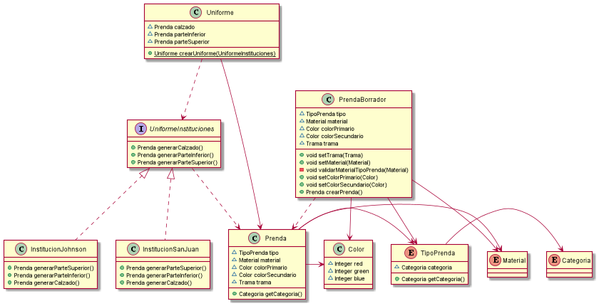

## Diagrama

## Explicacion

A la solucion propuesta en la iteracion 1

Se agrego:

### Clase `PrendaBorrador`

La cual es un builder de `Prenda` a la cual mediante el constructor solo se le indica el Tipo de Prenda, y luego mediate setter se van cargando los atributos. 

En estos setter se colocaron las validaciones necesarias para que la prenda sea valida. Restaria definir como se realizará la validacion entre el tipo de prenda contra el material para indicar si es valida.

Ademas existe un metodo `crearPrenda` el cual es el que se encarga de crear la prenda en su version final

### Clase `Uniforme`

Se encarga de definir como esta conformado un uniforme, y mediante un metodo de clase, el cual recibe un objeto de un uniforme crea diversos uniformes. Haciendo uso de un factory method crea los uniformes segun las instituciones

### Interfase `UniformeIteración`

Utilizada para que las distintas clases que tienen los uniformes de cada institucion entiendan los mismos metodos

### Clase `InstitucionJohnson` y `InstitucionSanJuan`

En estas clases se encuentran la configuracion de los uniformes de las instituciones

