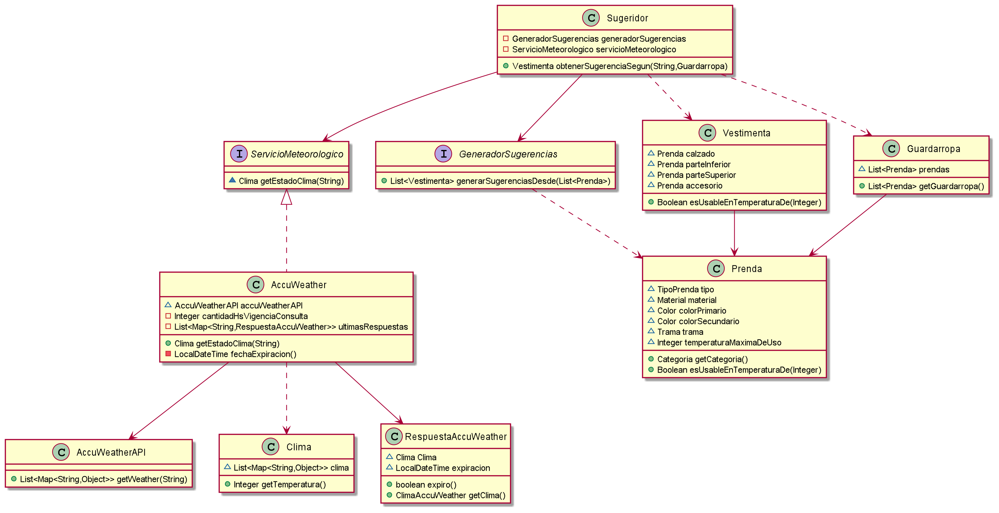

## Diagrama

## Explicacion

A la solucion propuesta en la iteracion 2

Se Modifico la Prenda/PrendaBorrado, agregandole el atributo que se encarga de almacenar el valor maximo de temperatura que se utiliza esa prenda.

Además para la Prenda se agrego un metodo que retorna booleano que a partir de una temperatura indica si la prenda es apta o no

### Clase `Vestimenta`

Es la encargada de encapsular la vestimenta, con una prenda por cada categoria. Ademas es la encargada de validar que todos los atributos sean aptos para una temperatura

### Clase `Guardarropa`

Se encarga almacenar todas las prendas de un guardarropa

### Interfase `GeneradoSugerencias`

Es la interfaz que se encarga de implementar una lista de vestimentas segun un guardarropas

### Clase `Sugeridor`

Se encarga de obtener a partir del `GeneradoSugerencias` obtener una vestimenta para el clima actual en una ciudad. Mediante inyeccion de dependencia hace uso de las clases `ServicioMeteorologico` y `GeneradorSugerencias`

### Interfase `GeneradoSugerencias`

Esta interfase define la forma de obtener el estado del clima de una ciudad. Para el caso de que haya otras formas de obtener el clima debera implementar el metodo `getEstadoClima`

### Clase `AccuWeather`

Encapsula la Api `AccuWeatheApi` para que solo se utilice una determinada cantidad de veces por la limitacion de la cantidad de usos por dia. Cabe aclarar que se podra usar por 8 veces como maximo por ciudad. Cada resultado del AccuWheather tendra una vigencia de 3hs (24hs/3hs=8 veces ) por ciudad.

### Clase `RespuestaAccuWeather`

Se encarga de modelar el `Clima` devuelto por la API y la fecha de expiracion de ese resultado

### Clase `Clima`

Se encarga de modelar el clima devuelto por la API. Y en particular obtener la temperatura del clima
