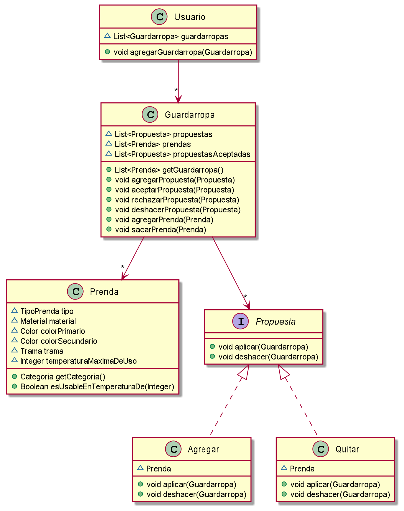

## Diagrama

## Explicacion

### Clase `Guardarropa`

A la clase que en las iteraciones anteriores, se le agrego:

1. Una lista de Sugerencias, la cual se encontraran las sugerencias de manera transitoria hasta que se acepten o rechacen. Para agregar en la lista esta se utiliza el metodo `agregarSugerencia`
2. Una lista de Sugerencias Aceptadas, en esta lista se encontraran las sugerencias que se aceptaron
3. Metodo `agregarSugerencia` la cual recibe la sugerencia y la agrega a la lista `sugerencias`
4. Metodo `aceptarSugerencia` la cual se encarga de sacar de la lista de sugerencias, y la agrega en sugerenciasAceptadas, ademas de enviar el mensaje aceptar a la sugerencia recibida.
5. Metodo `rechazarSugerencia` la cual se encarga de sacar de la lista de sugerencias, ademas de enviar el mensaje rechazar a la sugerencia recibida.
6. Metodo `deshacerSugerencia` la cual se encarga de buscar de la lista sugerenciaAceptadas y enviar el mensaje rechazar a la sugerencia que hay que deshacer.
7. Metodo `agregarPrenda` y `sacarPrenda` agrega y saca una prenda de la lista de prendas

### Interfase `Sugerencia`

Esta interfaz encapsula las implementaciones `Agregar` y `Quitar`

### Clase `Agregar`

Esta clase tiene un atributo Prenda, el cual es la prenda a la cual se va a agregar al guardarropa.

El metodo `aplicar` agregará la prenda a las prendas del guardarropa

El metodo `deshacer` quitar la prenda a las prendas del guardarropa

### Clase `Quitar`

Esta clase tiene un atributo Prenda, el cual es la prenda a la cual se va a quitar al guardarropa.

El metodo `aplicar` quitar la prenda a las prendas del guardarropa

El metodo `deshacer` agregará la prenda a las prendas del guardarropa

### Clase `Usuario`

Tiene como atributo una lista de Guardarropas, la cual cada usuario puede tener varios guardarropas. De esta forma se cumple el requerimiento que un usuario tenga mas de un guardarropa. No se agrego clasificacion de Guardarropa ya que eso es parte del criterio del usuario.

Metodo `agregarGuardarropa` se encarga de agregar un gardarropa a la lista. Para compartir un guardarropa, se deberá agregar el mismo guardarropa a dos usuarios distintos.

Metodo `proponerCambio` se encarga Guardarropa y una Sugerencia. La cual se le agrega la sugerencia al guardarropa que recibe. Cualquier objeto puede proponer un cambio a alguno de sus guardarropas

