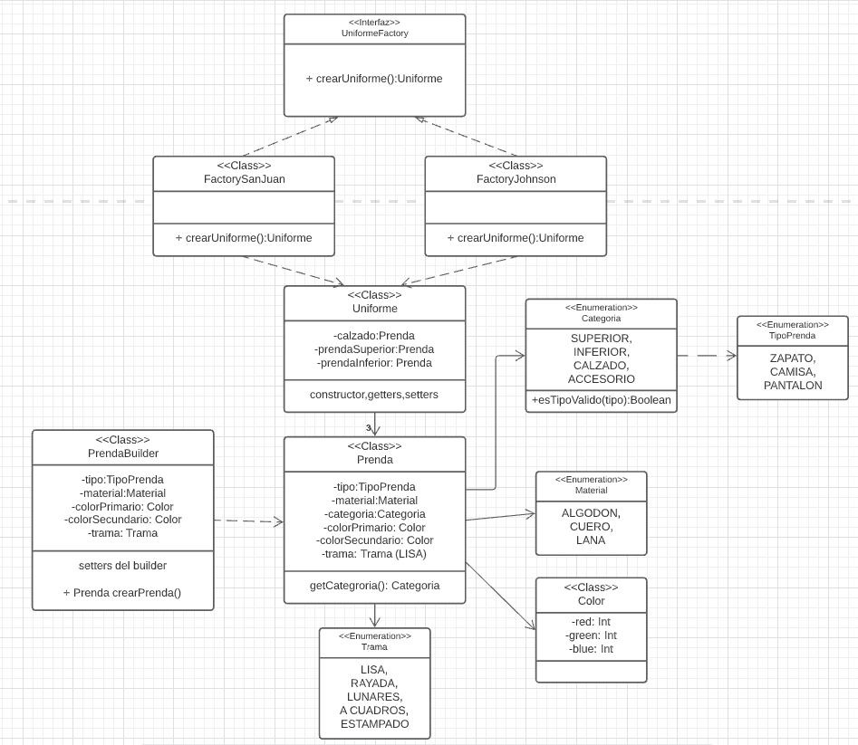

# QMP Iteración 2 - Grupo 10

## Diagrama de clases

 

## Explicacion

Se procedera a explicar citando los requerimientos del ejercicio la forma de resolucion del ejercicio.

* Como usuarie de QuéMePongo, quiero especificar qué trama tiene la tela de una prenda (lisa, rayada, con lunares, a cuadros o un estampado).

Este punto se resolvio agregando un <a href="https://github.com/mnigliazzo/qmp-grupo10/blob/emazzaglia-qmp-2-iteracion/src/main/java/ropa/Prenda.java#L18" target="__blank">Enumerable Trama</a> el cual contiene las distintas tramas (limitadas) que puede tener una prenda. 

* Como usuarie de QuéMePongo, quiero crear una prenda especificando primero de qué tipo es.

Como usuarie de QuéMePongo, quiero crear una prenda especificando en segundo lugar los aspectos relacionados a su material (colores, material, trama, etc) para evitar elegir materiales inconsistentes con el tipo de prenda.

Como usuarie de QuéMePongo, quiero guardar un borrador de la la última prenda que empecé a cargar para continuar después.

Como usuarie de QuéMePongo, quiero poder no indicar ninguna trama para una tela, y que por defecto ésta sea lisa.

Como usuarie de QuéMePongo, quiero poder guardar una prenda solamente si esta es válida.

Por otro lado, el equipo de producto está analizando potenciales futuras funcionalidades para la aplicación y, a fin de tener una estimación de su complejidad, nos pidió que esbocemos una solución a los siguientes requerimientos, orientados a integrar el software con colegios e instituciones privadas:

Como usuario QueMePongo, quiero que poder recibir sugerencias de uniformes armados.

Como usuario QueMePongo, quiero que un uniforme siempre conste de una prenda superior, una inferior y un calzado

~~~