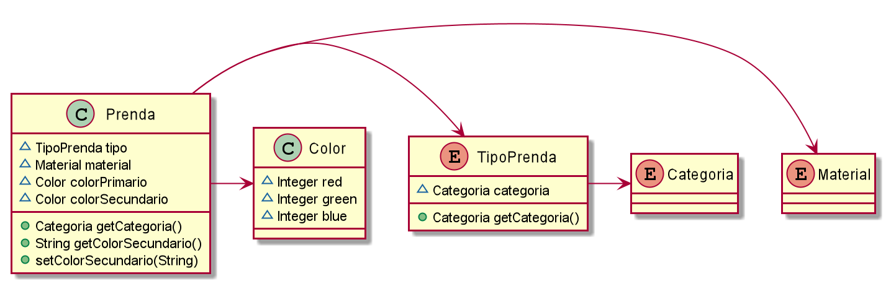

# [Enunciado](https://docs.google.com/document/d/1k1f-9AuIohlBGB2soSNePJ6jLxM37_tZeSD-hW_esIQ/edit)

## Diagrama



## Explicacion

### Enum `Categoria`

Se realizo un enum ya que según el relevamiento las categorias de las prendas son finitas.

### Clase `TipoPrenda`

Esta clase es la encargada de representar al tipo de prenda segun la categoria, indicando por ejemplo que una remera es de la partesuperior
El unico metodo que tiene esta clase es el engargado de devolver el atributo por el cual fue instanciada la clase

### Clase `Prenda`

Cuenta con los siguientes atributos:

- tipo: el cual representa el tipo de prenda
- material: representando el material del mismo, se modelo como String en el relevamiento no tiene comportamiento, ni representa una clasificacion finita
- colorPrimario y colorSecundario: representa los colores de la prenda, se modelo de igual forma que el material, de todas formas se podria crear una clase Color que represente con el codigo RGB el color de la prenda. De todas formas de dejo como String ya que al momento del relevamiento no se indico un comportamiento para estos atributos.

Como metodo:
 - Setter y Getter de colorSecundario. Ya que al ser opcional en el constructor no se coloca. Como desventaja queda alterable el color en cualquier momento.
 - getCategoria, es el encargado de obtener la categoria de la prenda. Esto lo hace a partir del atributo del tipo de prenda

Como validacion:
 - Para validar que se completen los campos tipos,material y colorPrimario, se validan que no se instancie con `null` y en el caso afirmativo se arroja una excepcion
 - Para validacion que no una prenda no pueda tener categoria y un tipodeprenda inconsistente, solo se pone como atributo a la prenda el tipodeprenda la cual tiene la categoria a cual pertenece


# java-base-project

# Ejecutar tests

```
mvn test
```

# Validar el proyecto de forma exahustiva

```
mvn clean verify
```

Este comando hará lo siguiente:

 1. Ejecutará los tests
 2. Validará las convenciones de formato mediante checkstyle
 3. Detectará la presencia de (ciertos) code smells
 4. Validará la cobertura del proyecto

# Entrega del proyecto

Para entregar el proyecto, crear un tag llamado `entrega-final`. Es importante que antes de realizarlo se corra la validación
explicada en el punto anterior. Se recomienda hacerlo de la siguiente forma:

```
mvn clean verify && git tag entrega-final && git push origin HEAD --tags
```

# Configuración del IDE (IntelliJ)

 1. Tabular con dos espacios: 
 2. Instalar y configurar Checkstyle:
    1. Instalar el plugin https://plugins.jetbrains.com/plugin/1065-checkstyle-idea:
    2. Configurarlo activando los Checks de Google: 
 3. Usar fin de linea unix
    1. En **Settings/Preferences**, ir a a **Editor | Code Style**.
    2. En la lista **Line separator**, seleccionar `Unix and OS X (\n)`.
 
